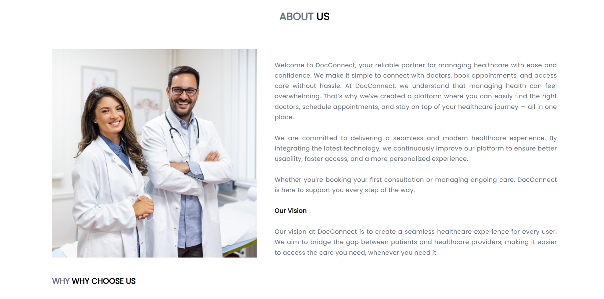
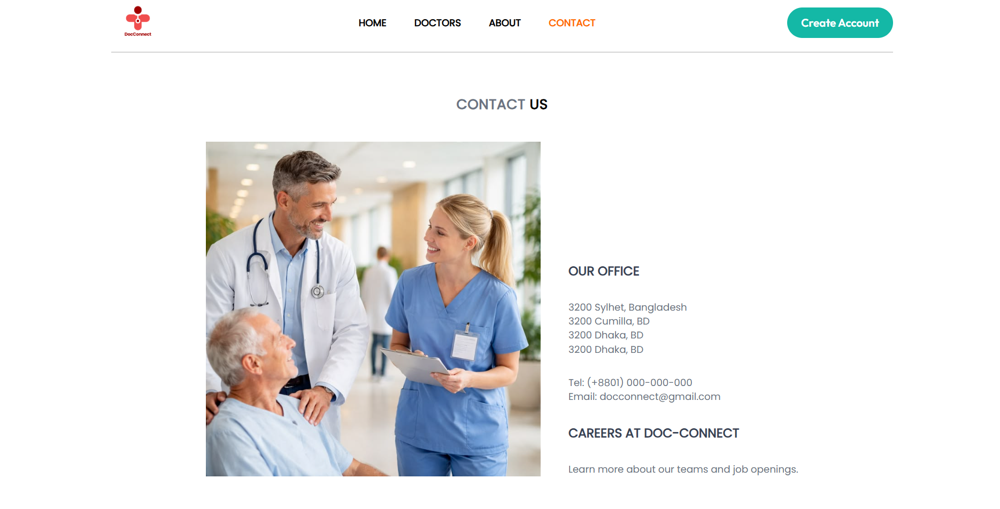
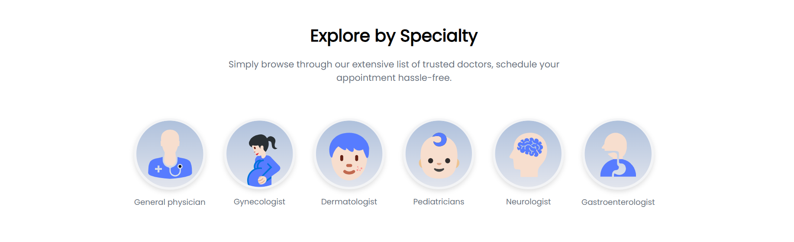
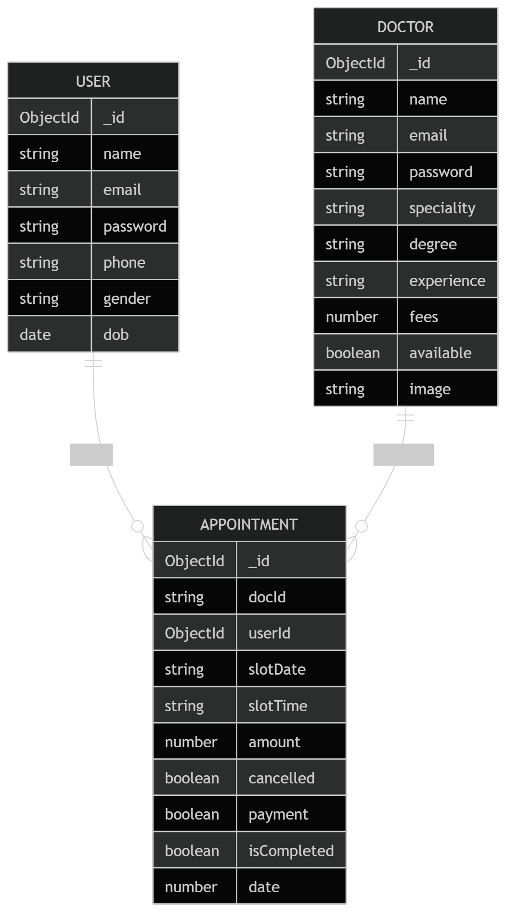

# 🚀 Project Title

DocConnect – Trusted Doctor Appointment System

---

## 📌 Overview

DocConnect is a web-based doctor appointment system that connects patients with trusted and verified healthcare professionals.
The platform allows users to search doctors, view their profiles, and book appointments online easily, reducing waiting time and improving access to healthcare services.

---

## 👥 Group Details

* **Group Number:** 10
* **Course Name:** CSE 224
* **Instructor:** Fahmidur Rahman Sakib

### 🧑‍🤝‍🧑 Team Members

| Name                | ID          | Contribution |
|---------------------|-------------|--------------|
| Faria Sultana Monia | 241-115-032 | Complete Project Development (Frontend, Backend, Database, UI Design, Testing & Documentation) |

---

## 🎯 Objective

The objective of the DocConnect system is to simplify the process of booking doctor appointments through an online platform.

The system aims to:

* Reduce patient waiting time
* Provide easy access to verified doctors
* Allow users to manage appointments efficiently
* Help healthcare providers manage schedules digitally

---

## ✨ Features

* ✅ User Registration & Login
* ✅ Doctor Search by Specialization
* ✅ Doctor Profile Viewing
* ✅ Online Appointment Booking
* ✅ Appointment Cancellation & Rescheduling
* ✅ Admin Dashboard
* ✅ Doctor Verification System
* ✅ Real-time Notifications

---

## 🖼️ Project Preview

### 🔹 UI Screenshots

### Frontend

 
 
 
 
 
 
 
 
 
 

 
 
 
 


### Admin

 
 
 


---

### 🔹 ER Diagram




---

## 🏗️ Tech Stack

### Frontend

The frontend is developed using **React with Vite** for fast development and efficient performance.
**Tailwind CSS** is used for modern and responsive UI design to ensure compatibility across desktop, tablet, and mobile devices.

### Backend

The backend is built using **Node.js and Express.js**, which handle API requests, authentication, and business logic such as appointment management and user verification.

### Database

The system uses **MongoDB** as the database to store user information, doctor profiles, appointments, and reviews.
MongoDB provides flexible schema design and efficient data retrieval for dynamic applications.

---

## ⚙️ Installation & Setup

```bash
# Clone the repository
git clone https://github.com/faria987/doc-connect.git

# Navigate to project folder
cd doc-connect

# Install dependencies
npm install

# Run the project
npm start
```

---

## 🗂️ Project Structure

```
/doc-connect
│
├── admin/
│   ├── src/
│   ├── components/
│   └── pages/
|
|
├── frontend/
│   ├── src/
│   ├── components/
│   └── pages/
│
├── backend/
│   ├── controllers/
│   ├── models/
│   ├── routes/
│   └── server.js
│
├── er-diagram.png
|
├── project proposal.md
│ 
|
│
├── screenshots/
│
└── README.md
```
## 🎥 Demo Video

👉 Watch Project Demo

[Click here to watch the admin demo video](https://drive.google.com/file/d/1HAl5Kp3leOLDid2aTIl_RcpScEDqOCcy/view?usp=drive_link)

[Click here to watch the backend and data base demo video](https://drive.google.com/file/d/1933LgJdLxSb2TIj9WevQIF_QTUqVE_Iu/view?usp=drive_link)

[Click here to watch the frontend demo video](https://drive.google.com/file/d/1mNvIqet5nyJj-MeV6g9i3RpZAKMmtM5k/view?usp=drive_link)
---
